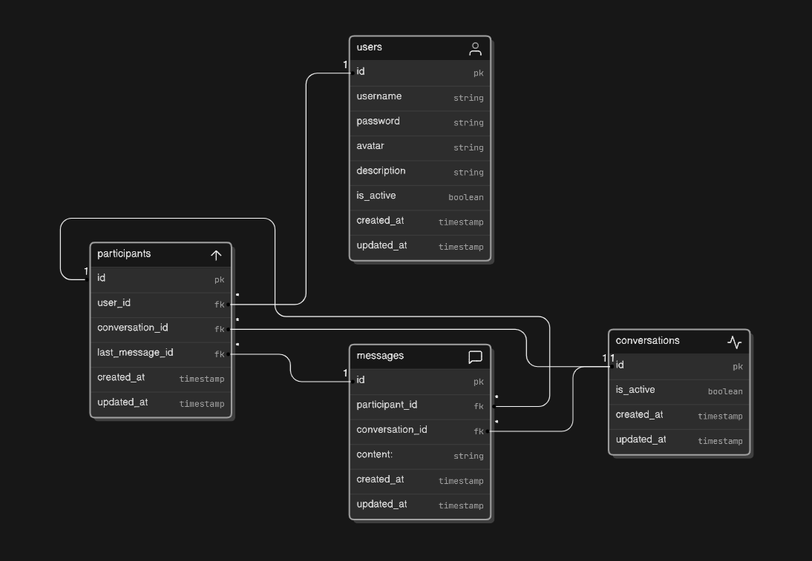

# Realtime Chat App


https://github.com/user-attachments/assets/9dbbc19a-2f4e-4b92-99a0-bb5cacc75e0d


### About
One to one chat application built in NestJS and React

### Run & Environment Variables

💻 <ins><b>Without Docker</b></ins>

The backend requires 2 environment variables that should be placed at .env in backend's root directory 

```
# .env.example

DATABASE_URL=
SECRET_KEY=
```

then you will need to run the following commands

```
npx drizzle-kit migrate
npm run build
npm run seed              # Optional ~ creates 10 fake users
npm run start:prod
```

🐳 <ins><b>With Docker & Docker Compose</b></ins>

If you are using Docker Compose, you can omit the environment variables. The setup will automatically create and use a default database along with a dummy secret key that I have configured.
```
docker-compose up --build
```


### Database



### Notable design choices
- Each user is automatically connected to a single WS channel through which they receive all their incoming messages

- Each connection/message received on WS gateway is authenticated

- Simple authentication logic, the user only receives an access token, once expired, they will need to login again

- `Participants` table has a nullable foreign key to messages `(last_read_message_id)`, this is used to keep track of each participant's unread messages. While this optimizes calculating the unread messages count, it could still not be the best fit when deleting messages is a feature

### Challenges
- When implementing cursor pagination for messages, I initially used the `created_at` column. However, I encountered an issue: Drizzle, by default, converts timestamps into `Date` objects. This caused the last message of each page to be duplicated because `Date` objects only preserve the first three digits of the milliseconds part. this could have been fixed by changing the default return mode to `string` (Refernce below) but I prefered using the primary key

### Important references
- https://github.com/nestjs/nest/issues/882
- https://www.youtube.com/watch?v=4h9-c6D5Pos
- https://orm.drizzle.team/docs/guides/timestamp-default-value


